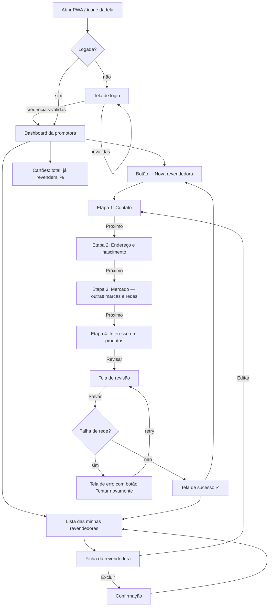
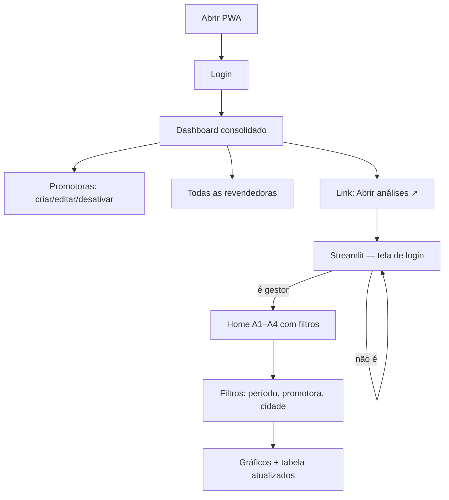

# App Flow — RB Prospecta

**Versão:** 1.0 · **Data:** 27/09/2026
**Depende de:** PRD v1.0, TRD v1.0

Mapa de navegação e jornada do usuário. Duas aplicações: **Django** (PWA) e **Streamlit** (análises).

## 1. Mapa de rotas — Django

| Rota | View | Perfil | Tela |
|---|---|---|---|
| `/contas/entrar/` | `LoginView` | público | Login |
| `/contas/sair/` | `LogoutView` | qualquer | — (redirect) |
| `/` | `DashboardView` | logado | Dashboard (variante por perfil) |
| `/promotoras/` | `PromotoraListView` | gestor | Lista de promotoras |
| `/promotoras/nova/` | `PromotoraCreateView` | gestor | Form de promotora |
| `/promotoras/<id>/editar/` | `PromotoraUpdateView` | gestor | Form de promotora |
| `/revendedoras/` | `RevendedoraListView` | logado | Lista (escopo do perfil) |
| `/revendedoras/nova/` | `RevendedoraCreateView` | logado | **Formulário de campo (stepper)** |
| `/revendedoras/<id>/` | `RevendedoraDetailView` | logado | Ficha da revendedora |
| `/revendedoras/<id>/editar/` | `RevendedoraUpdateView` | dona/gestor | Form (mesmo stepper) |
| `/revendedoras/<id>/excluir/` | `RevendedoraDeleteView` | dona/gestor | Confirmação |
| `/saude/` | `HealthView` | público | `{"status": "ok"}` |

**Streamlit** (app separado, porta 8501):

| Rota | Tela | Perfil |
|---|---|---|
| `/` (Streamlit Home) | Login Streamlit | público → gestor |
| `/A1_cadastros_por_promotora` | Gráfico + tabela | gestor |
| `/A2_ja_revendem` | Gráfico + tabela | gestor |
| `/A3_marcas` | Gráfico + tabela | gestor |
| `/A4_interesse_produtos` | Gráfico + tabela | gestor |

## 2. Jornada — Promotora (campo)

### Detalhe das etapas do formulário

| Etapa | Campos | Validação ao avançar |
|---|---|---|
| 1 · Contato | nome*, telefones/whatsapp* (múltiplo), e-mail, redes sociais (perfil + contato/seguir) | nome ≥ 3 palavras? (aviso, não trava), 1 telefone válido, e-mail se preenchido |
| 2 · Endereço | CPF, RG, endereço, bairro, cidade, CEP, data nascimento | CPF válido e único; CEP 8 dígitos; data válida e ≥ 18 anos (aviso) |
| 3 · Mercado | vende outras marcas? (sim/não) → se sim: quais marcas (múltipla + livre) | se "sim", ≥ 1 marca |
| 4 · Interesse | categorias de produto (múltipla) | ≥ 1 categoria |
| Revisão | Resumo de tudo + botões Voltar/Salvar | — |

> O campo **"já revende"** nunca aparece: derivado das marcas da Etapa 3 (RF-04).

## 3. Jornada — Gestor

## 4. Estados de interface

| Estado | Onde | Comportamento |
|---|---|---|
| **Vazio** | Lista sem cadastros | Ícone + "Nenhuma revendedora ainda" + botão `+ Nova revendedora` |
| **Carregando** | Troca de etapa, submissão | Spinner no botão, botão desabilitado (evita duplo envio) |
| **Erro de validação** | Campos do form | Mensagem sob o campo + sumário no topo; dados preservados |
| **Erro de rede** | Ao salvar | Tela "Sem conexão — seus dados não foram perdidos" + `Tentar novamente` |
| **Offline (PWA)** | Shell em cache | Aviso fixo no topo: `Você está offline` |
| **Não autorizado** | Rota de perfil errado | 403 com link "Voltar ao início" |
| **Não logado** | Qualquer rota protegida | Redirect para login com `?next=` |

## 5. Regras de navegação

1. Acesso a rota protegida sem sessão → login com retorno ao `next`.
2. Promotora em rota de gestor → 403.
3. Editar/excluir revendedora de outra promotora → 403 (escopo no queryset).
4. Após `Salvar` → nunca voltar para o form com `POST` (patrulha PRG) → tela de sucesso.
5. Voltar no stepper mantém o preenchimento (dados no `session` ou formulário re-renderizado).
6. Logout limpa o `session` e o cache do shell permanece (só dados são revalidados).
