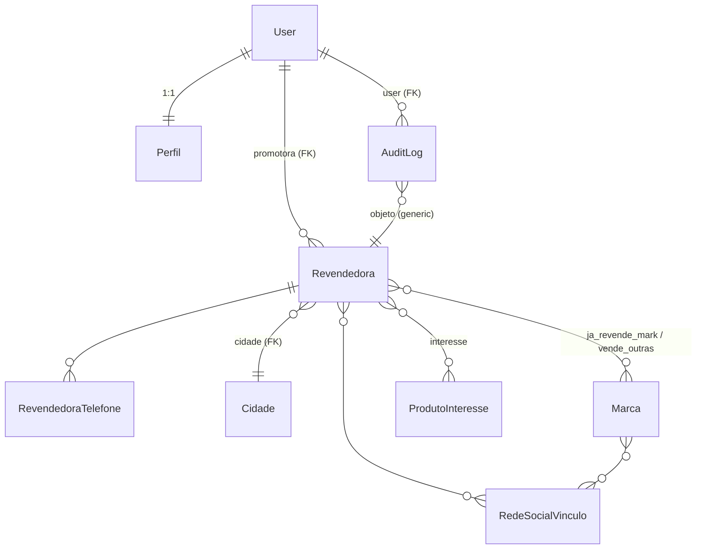

# Esquema do Backend — RB Prospecta

**Versão:** 1.0 · **Data:** 27/09/2026
**Depende de:** PRD v1.0, TRD v1.0 · **Banco:** PostgreSQL 16 (dev e prod)

## 1. Diagrama ER



> Diagrama simplificado; as tabelas de N:N com atributo próprio
> (`RevendedoraTelefone`, `RedeSocialVinculo`) aparecem detalhadas nas seções.

## 2. Tabelas

### 2.1 `auth_user` (Django nativo) + `core_perfil`

O `User` padrão é estendido por perfil 1:1. `USERNAME_FIELD = 'email'`.

**`core_perfil`**

| Coluna | Tipo | Constraints | Observação |
|---|---|---|---|
| `id` | bigint | PK | |
| `user_id` | bigint | FK → `auth_user`, UNIQUE, NOT NULL, CASCADE | |
| `role` | varchar(20) | NOT NULL, CHECK IN (`promotora`,`gestor`) | default `promotora` |
| `nome_completo` | varchar(120) | NOT NULL | |
| `territorio` | varchar(120) | NULL | cidade/estado da promotora |
| `ativo` | boolean | NOT NULL, default true | soft delete de promotora |
| `criado_em` | timestamptz | NOT NULL, default `now()` | |

Índice: `uniq_user` (PK/UNIQUE implícito em `user_id`).

### 2.2 `prospeccao_revendedora` (entidade central)

| Coluna | Tipo | Constraints | PRD |
|---|---|---|---|
| `id` | bigint | PK | |
| `promotora_id` | bigint | FK → `auth_user`, NOT NULL, `ON DELETE=RESTRICT` | RF-03.8 |
| `nome_completo` | varchar(120) | NOT NULL | RF-03.1 |
| `cpf` | varchar(11) | **UNIQUE**, NULL, só dígitos | RF-03.2 |
| `rg` | varchar(20) | NULL | |
| `email` | varchar(254) | NULL | valida formato |
| `data_nascimento` | date | NULL, CHECK `<= now()` | RF-03.3 |
| `endereco` | varchar(160) | NULL | |
| `bairro` | varchar(80) | NULL | |
| `cidade_id` | bigint | FK → `prospeccao_cidade`, NOT NULL | RF-03.3 |
| `cep` | varchar(8) | NULL, CHECK `~ '^\d{8}$'` | RF-03.3 |
| `vende_outras_marcas` | boolean | NOT NULL, default false | RF-03.5 |
| `ja_revende` | boolean | NOT NULL, default false | **RF-04.1 derivado** |
| `observacao` | text | NULL | livre da promotora |
| `criado_em` | timestamptz | NOT NULL, default `now()` | |
| `atualizado_em` | timestamptz | NOT NULL, auto | |
| `desativado_em` | timestamptz | NULL | exclusão lógica |

Índices:
- `ix_revendedoras_promotora` → `(promotora_id, criado_em DESC)` — dashboard/lista
- `ix_revendedoras_ja_revende` → `(ja_revende)` — análises A2
- `ix_revendedoras_cidade` → `(cidade_id)`
- `ix_revendedoras_cpf` — UNIQUE implícito
- Busca: `pg_trgm` em `nome_completo` (extensão habilitada em migration)

**Regra derivada (RF-04):**

```python
# prospeccao/signals.py
@receiver(m2m_changed, sender=Revendedora.marcas_revendidas.through)
def recalcula_ja_revende(sender, instance, action, **kwargs):
    if action in {"post_add", "post_remove", "post_clear"}:
        instance.ja_revende = instance.marcas_revendidas.exists()
        instance.save(update_fields=["ja_revende"])
```

> `ja_revende == vende_outras_marcas AND tem marcas` — na prática o form força
> `>= 1 marca` quando `vende_outras_marcas=True`, então `ja_revende = marcas.exists()`.

### 2.3 `prospeccao_cidade`

Para agregação limpa nas análises (evita cidade escrita de 10 formas).

| Coluna | Tipo | Constraints |
|---|---|---|
| `id` | bigint | PK |
| `nome` | varchar(80) | NOT NULL |
| `uf` | char(2) | NOT NULL, CHECK `~ '^[A-Z]{2}$'` |
| `nome_norm` | varchar(80) | NOT NULL | lower+trim, UNIQUE com `uf` |

`UNIQUE (nome_norm, uf)`.

### 2.4 `prospeccao_telefone` (N:N com atributo — RF-03.4)

| Coluna | Tipo | Constraints |
|---|---|---|
| `id` | bigint | PK |
| `revendedora_id` | bigint | FK → revendedora, CASCADE, NOT NULL |
| `numero` | varchar(11) | NOT NULL, só dígitos, CHECK `length>=10` |
| `tipo` | varchar(20) | NOT NULL, CHECK IN (`whatsapp`,`telefone`,`outro`), default `whatsapp` |
| `principal` | boolean | NOT NULL, default false |

`UNIQUE (revendedora_id, numero)` · Índice `(numero)`.
**Mínimo 1 telefone:** validação `clean()` do form (RF-03.1) + `CHECK` via trigger? — MVP: validação no form e no `full_clean()`.

### 2.5 `prospeccao_marca`

| Coluna | Tipo | Constraints |
|---|---|---|
| `id` | bigint | PK |
| `nome` | varchar(80) | UNIQUE, NOT NULL |
| `ativa` | boolean | NOT NULL, default true |

Seed: marcas concorrentes conhecidas do mercado + opção "Outro" tratada no form
(cria `Marca` com `ativa=true` se não existir).

### 2.6 `prospeccao_revendedora_marcas` (N:N — RF-03.5, alimenta A3)

| Coluna | Tipo |
|---|---|
| `id` | bigint PK |
| `revendedora_id` | FK → revendedora, CASCADE |
| `marca_id` | FK → marca, CASCADE |

`UNIQUE (revendedora_id, marca_id)`.

### 2.7 `prospeccao_produtointeresse`

| Coluna | Tipo | Constraints |
|---|---|---|
| `id` | bigint | PK |
| `nome` | varchar(60) | UNIQUE, NOT NULL |
| `ordem` | smallint | NOT NULL, default 0 |
| `ativa` | boolean | NOT NULL, default true |

Seed (RF-03.7): `cosméticos, vitaminas, suplementos, alimentos, roupa íntima,
roupa fitness, bijuteria, sapato, remédios, outros`.

### 2.8 `prospeccao_revendedora_interesses` (N:N — alimenta A4)

| Coluna | Tipo |
|---|---|
| `id` | bigint PK |
| `revendedora_id` | FK → revendedora, CASCADE |
| `produto_id` | FK → produto, CASCADE |

`UNIQUE (revendedora_id, produto_id)`.

### 2.9 `prospeccao_rede_social` (catálogo)

| Coluna | Tipo | Constraints |
|---|---|---|
| `id` | bigint | PK |
| `nome` | varchar(40) | UNIQUE (`instagram`,`facebook`,`tiktok`,`whatsapp`,`outra`) |

### 2.10 `prospeccao_redesocialvinculo` (N:N com atributo — RF-03.6)

| Coluna | Tipo | Constraints |
|---|---|---|
| `id` | bigint | PK |
| `revendedora_id` | FK → revendedora, CASCADE, NOT NULL |
| `rede_id` | FK → rede_social, CASCADE, NOT NULL |
| `perfil` | varchar(120) | NOT NULL | @usuario ou URL |
| `para_contato` | boolean | NOT NULL, default false |
| `para_seguir` | boolean | NOT NULL, default false |

`UNIQUE (revendedora_id, rede_id)`.

### 2.11 `core_auditlog` (RNF-05)

| Coluna | Tipo | Constraints |
|---|---|---|
| `id` | bigint | PK |
| `user_id` | FK → auth_user, SET_NULL, NULL | |
| `model` | varchar(64) | NOT NULL |
| `obj_id` | bigint | NOT NULL |
| `acao` | varchar(16) | CHECK IN (`create`,`update`,`delete`) |
| `payload` | jsonb | snapshot do diff |
| `criado_em` | timestamptz | default `now()` |

Índice `(model, obj_id)` e `(criado_em)`.

## 3. Relacionamento com os formulários

| Campo do formulário (PRD) | Coluna/tabela |
|---|---|
| nome completo* | `revendedora.nome_completo` |
| telefones / whatsapp* | `telefone` (N:N) |
| CPF | `revendedora.cpf` |
| RG | `revendedora.rg` |
| endereço / bairro / cidade / CEP | `endereco`, `bairro`, `cidade_id`, `cep` |
| data nascimento | `revendedora.data_nascimento` |
| e-mail | `revendedora.email` |
| vende outras marcas? + quais | `vende_outras_marcas` + `revendedora_marcas` |
| redes sociais (qual p/ contato e seguir) | `redesocialvinculo` |
| produtos de interesse | `revendedora_interesses` |
| *(derivado)* já revende | `revendedora.ja_revende` |
| promotora responsável | `revendedora.promotora_id` |

## 4. As 4 análises (queries de referência)

Base comum (Streamlit, `analytics/db.py`):

```sql
-- todos os filtros (período, promotora, cidade) entram aqui como CTE base
WITH base AS (
  SELECT r.*, c.nome AS cidade_nome, c.uf, u.email AS promotora_email
  FROM prospeccao_revendedora r
  JOIN prospeccao_cidade c ON c.id = r.cidade_id
  JOIN auth_user u ON u.id = r.promotora_id
  WHERE r.desativado_em IS NULL
    AND r.criado_em BETWEEN :de AND :ate            -- período (opcional)
    AND (:promotora_id IS NULL OR r.promotora_id = :promotora_id)
    AND (:cidade_id     IS NULL OR r.cidade_id     = :cidade_id)
)
SELECT * FROM base;
```

### A1 — Cadastros por promotora (RF-06.1)

```sql
SELECT p.nome_completo            AS promotora,
       p.territorio,
       COUNT(b.id)                AS cadastradas,
       COUNT(b.id) FILTER (WHERE b.ja_revende) AS ja_revendem
FROM base b
JOIN core_perfil p ON p.user_id = b.promotora_id
GROUP BY 1, 2
ORDER BY cadastradas DESC;
```

### A2 — Quantas já revendem (RF-06.1)

```sql
SELECT COUNT(*)                                   AS total,
       COUNT(*) FILTER (WHERE ja_revende)         AS ja_revendem,
       ROUND(100.0 * COUNT(*) FILTER (WHERE ja_revende) / NULLIF(COUNT(*),0), 1) AS pct
FROM base;
```

Quebra opcional por cidade/promotora: adicionar `GROUP BY cidade_nome` etc.

### A3 — Marcas que já revendem (RF-06.1)

```sql
SELECT m.nome                AS marca,
       COUNT(*)              AS revendedoras,
       ROUND(100.0 * COUNT(*) / NULLIF((SELECT COUNT(*) FROM base WHERE ja_revende),0), 1) AS pct
FROM base b
JOIN prospeccao_revendedora_marcas rm ON rm.revendedora_id = b.id
JOIN prospeccao_marca m ON m.id = rm.marca_id
GROUP BY m.nome
ORDER BY revendedoras DESC;
```

### A4 — Interesse em produtos (RF-06.1)

```sql
SELECT pi.nome               AS categoria,
       COUNT(*)              AS interessadas,
       ROUND(100.0 * COUNT(*) / NULLIF((SELECT COUNT(*) FROM base),0), 1) AS pct
FROM base b
JOIN prospeccao_revendedora_interesses ri ON ri.revendedora_id = b.id
JOIN prospeccao_produtointeresse pi ON pi.id = ri.produto_id
GROUP BY pi.nome, pi.ordem
ORDER BY pi.ordem, interessadas DESC;
```

### Dashboard Django (mesmas métricas via ORM)

```python
Revendedora.objects.filter(desativado_em__isnull=True, promotora=request.user) \
    .aggregate(total=Count("id"),
               ja_revendem=Count("id", filter=Q(ja_revende=True)))

Revendedora.objects.filter(desativado_em__isnull=True) \
    .values("promotora__perfil__nome_completo") \
    .annotate(total=Count("id"), ja_revendem=Count("id", filter=Q(ja_revende=True))) \
    .order_by("-total")
```

## 5. Regras de integridade

| Regra | Mecanismo |
|---|---|
| CPF único | `UNIQUE` + validação `django-localflavor` no form |
| `ja_revende` coerente | signal `m2m_changed` (RF-04.1) + teste de regressão |
| ≥ 1 telefone | `Revendedora.clean()` |
| ≥ 1 categoria de interesse | `Revendedora.clean()` |
| ≥ 1 marca quando `vende_outras_marcas=True` | `Revendedora.clean()` |
| Escopo por promotora | queryset filtrado na view (não em template) |
| Soft delete | `desativado_em`; listagens filtram sempre |
| `role` válido | `CHECK` no banco |
| Sem cascade destrutivo de promotora | `ON DELETE=RESTRICT` em `revendedora.promotora` |

## 6. Migrations

- Toda alteração de schema via `makemigrations` versionado.
- Seeds em migration **data**: `core` (grupos `promotora`/`gestor`), `prospeccao`
  (cidades iniciais, produtos de interesse, marcas, redes sociais).
- Nada de `RunSQL` cru no MVP.

## 7. Extensões Postgres

```sql
CREATE EXTENSION IF NOT EXISTS pg_trgm;   -- busca por nome (migration)
```
